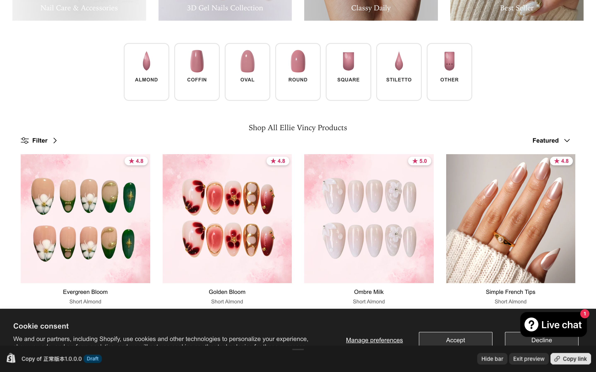

# Nail Shape Filter — Shopify App

A Shopify **Theme App Extension** that adds a 7-button nail-shape selector to collection pages, driven by Shopify's standard `shopify.nail-shape` taxonomy metafield.



## What it does

When a customer lands on a collection page, the app injects 7 shape buttons above the product grid: **Almond · Coffin · Oval · Round · Square · Stiletto · Other**. Clicking a button filters the collection to products tagged with that shape — without a full page reload — by driving the theme's existing native filter pipeline.

Behaviour highlights:

- **AJAX-driven**: clicks programmatically toggle the theme's sidebar nail-shape checkbox and dispatch a native `change` event, letting the theme's own `data-ajax-filtering` machinery swap the product grid in place. No hard navigation, scroll position pinned across swaps.
- **Two-way sync**: when a customer uses the left sidebar to change the filter, the top buttons update to match (and vice versa) — they share the same URL parameter (`?filter.v.t.shopify.nail-shape=gid://...`).
- **Active-state chip**: "Selected: Almond" appears next to the theme's Filter button while a filter is active, with an inline "Clear" link. Hidden on mobile to save horizontal space.
- **Frosted-glass loading overlay**: a brief "Updating products…" spinner card with a `backdrop-filter: blur` while the AJAX swap is in flight.
- **Self-healing**: a 250 ms polling check re-injects the label/buttons if the theme's AJAX swap wipes them out (Symmetry sometimes does this). Also hooks `history.pushState` for immediate response.
- **Conditional render**: the widget only appears on collections that actually expose nail-shape as a filter facet — collections without it (e.g. nail accessories) get no buttons.
- **Fallback to navigation**: if the theme's AJAX pipeline isn't available, the widget falls back to a clean URL navigation (`window.location.href`) with the same filter param.

## Project layout

```
.
├── nail-shade-category/                # Shopify CLI app project
│   ├── shopify.app.toml
│   ├── extensions/theme/               # Theme App Extension
│   │   ├── blocks/nail-shape-filter.liquid
│   │   ├── assets/filter-widget.js
│   │   ├── assets/filter-widget.css
│   │   ├── assets/nail-*.svg            # Square / Stiletto / Other / Almond icons
│   │   └── assets/*-FancyPageSwatch.png # Coffin / Oval / Round (PNG renders)
│   └── locales/en.default.json
├── scripts/                            # Standalone helper scripts (CLI)
│   ├── create-metafield.js             # Prints the metafield definition payload
│   ├── migrate-nail-shape.js           # CSV-driven bulk metafield migration (dry-run by default)
│   └── nail-shape-sample.csv
├── web/frontend/admin/                 # Admin UI placeholder
└── docs/
    └── preview-shop-app.png            # Storefront screenshot used in README
```

## How the filter actually works

The widget does **not** keep its own database of which product has which shape. The single source of truth is the standard Shopify metafield:

- Namespace: `shopify`
- Key: `nail-shape`
- Type: `list.taxonomy_reference`
- Values: references to standard Shopify Taxonomy nodes (Almond `gid://shopify/TaxonomyValue/20161`, Coffin `…/10749`, Oval `…/20164`, Round `…/20165`, Square `…/20166`, Stiletto `…/10753`, Other `…/20163`).

The merchant edits a product's shape in Admin → Product → Metafields → "Shape". The same metafield drives the theme's sidebar filter via Shopify's Search & Discovery. Our top widget is just a more visual entry point into the same URL-parameter filter.

A product tagged with multiple shapes (e.g. *Almond and Square*) shows up under each of those filters.

## Develop locally

The Shopify CLI app lives in `nail-shade-category/`. From there:

```bash
cd nail-shade-category
npm run dev          # shopify app dev — starts tunnel + dev store sync
npm run deploy       # shopify app deploy — pushes a new app version
```

`shopify app deploy` releases a new version to all stores that have the app installed; the App Embed must be enabled in each theme's customizer for the widget to actually render.

## Regenerate the README screenshot

```bash
node /tmp/snap.mjs   # see git history for the puppeteer script
```

The screenshot is taken against a Shopify Theme Editor share-preview URL, with email-signup popups and chat widgets dismissed before capture.

## Version history

Tracked in the App Embed `schema.settings` block — the current version string and release notes are visible in the Theme Editor under "App embeds → Nail Shape Filter".

Recent shipped versions:

- **v0.7.2** — Self-healing label re-injection, scroll position pinned across AJAX, hide widget on collections without nail-shape filter facet, new Almond SVG.
- **v0.7.1** — Hook `history.pushState` + `MutationObserver` to re-render label after Symmetry AJAX wipes the utility-bar.
- **v0.7.0** — Switch from full-page navigation to AJAX via theme's sidebar checkboxes.
- **v0.6.x** — Loading overlay, font-size tuning, OTHER button moved to last, SVG icon refresh, scrollIntoView active button on load.
- **v0.5.x** — Align top buttons 1:1 with Shopify standard nail-shape taxonomy (Almond/Coffin/Other/Oval/Round/Square/Stiletto). Case-insensitive match, metaobject-aware Liquid lookup, multi-shape product support.
- **v0.4.0** — Initial scaffold with hardcoded 6-button row (super_short/oval/almond/squoval/round/coffin).

## License

UNLICENSED — internal merchant tooling for Ellie Vincy Nails.
